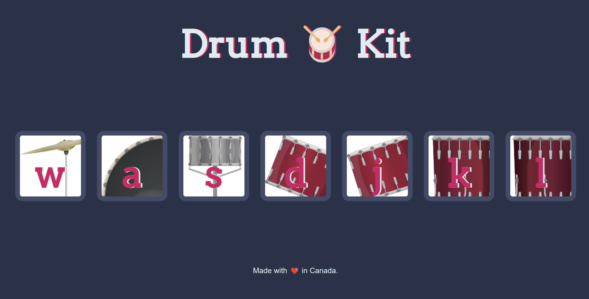

# 🥁 Drum Kit

Un mini projet interactif en JavaScript pour simuler une batterie virtuelle. Clique sur les boutons ou utilise ton clavier pour jouer des sons de batterie en temps réel !

## 🎮 Démo

➡️ Appuie sur l’une des touches **w, a, s, d, j, k, l** pour jouer un son.

Chaque touche joue un son différent :
- `w` → crash
- `a` → kick
- `s` → snare
- `d` → tom 1
- `j` → tom 2
- `k` → tom 3
- `l` → tom 4

## 🖥️ Technologies utilisées

- HTML5
- CSS3
- JavaScript (DOM + Events + Audio)

## 📸 Aperçu visuel

Voici quelques captures utilisées dans le projet :

_(les autres sont également dans le dossier `images/`)_

## 📂 Arborescence

